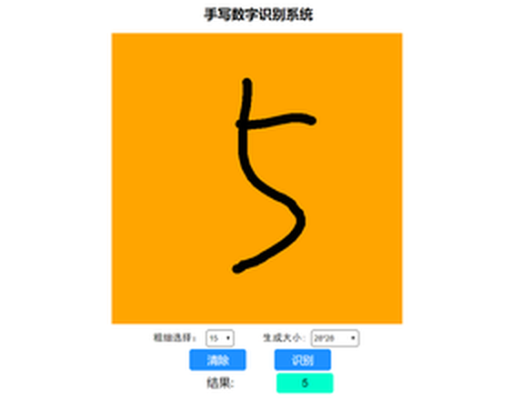
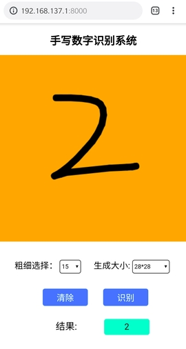
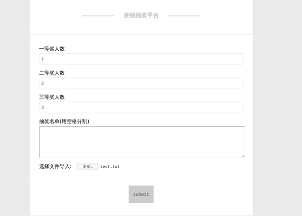

# Tornado Demo
用Tornado做的一些项目练习，有的比较完整，是一整个项目，有的比较零星，只是在练习某些用法。

项目名后加了UI的，都是对原本的同名项目进行了完善和美化，相反，原本的项目会比较简陋，只是初期的版本。

## 目录
* [template_project](#template_project)
* [chatInWeb_UI](#chatInWeb_UI)
* [handwrittenDigitRecognition](#handwrittenDigitRecognition)
* [flowerRecognitionPractice](#FlowerRecognitionPractice)
* [lotteryOnline_UI](#lotteryOnline_UI)
* [AsyncPractice](#AsyncPractice)
* [h5Practice](#h5Practice)

## 运行
完整的项目基本上都是用到了WebSocket，所以运行的话，**直接运行server.py即可**

- PC端：浏览器打开127.0.0.1:端口号，端口这里在config.py查看，一般是8000
- 移动端：如果是在自己电脑运行，请将手机连接到电脑的热点上，共用一个局域网，然后使用chrome浏览器打开电脑主机ip:8000；如果是在服务器运行，请用chrome浏览器打开服务器ip:8000

## template_project
**每次做项目的模板**，如果是Tornado的相关项目，可以直接download后修改路由和config端口

### 目录结构
> ├── application.py　　　　　　　　　　　　//路由配置文件    
> ├── config.py　　　　　　　　　　　 　　　//tornado配置文件    
> ├── server.py　　　　　　　　　　　 　　　//server服务器    
> ├── static　　　　　　　　　　　　　　　　//静态文件    
> │   ├── css　　　　　　　　　　　　 　　　//CSS样式文件目录    
> │   ├── html　　　　　　　　　　　  　　　//HTML文件目录    
> │   └── js　　　　　　　　　　　　　　　　//JavaScript文件目录    
> │       └── jquery.min.js    
> ├── templates　　　　　　　　　　　 　　　//模板文件目录    
> ├── upfiles    
> └── views　　　　　　　　　　　　　 　　　//视图文件目录，各个Handler写在这里面    
>      └── index.py    

static目录下的js/, css/, html/, images，这几个目录按需求自己创建

## chatInWeb_UI
### 介绍
**在线多人聊天系统**，数据不进数据库，记录在内存，HTML+CSS+JS+Tornado+Websocket

### 功能
- 用户名登录，由于没有用数据库，所以没有完善注册功能，密码验证也没有
- 用户id
- 创建聊天室
- 切换聊天室
- 退出聊天室
- 退出聊天室再加入时，能够恢复历史在线时间的聊天记录
- 同一聊天室多人聊天
- 聊天记录同步
- 显示时间
- 发送全局消息

### 运行截图
登录界面:

小明视角:   

小白视角:    

## handwrittenDigitRecognition
### 介绍
**手写数字识别系统**，基于LeNet-5和MNIST

主要是在浏览器使用鼠标或者手写数字，发送到后端用Tensorflow训练的模型识别

兼容PC端和移动端，推荐用chrome打开页面

HTML+CSS+JS+Canvas+Tornado+Websocket+Tensorflow+LeNet-5模型

项目过程中遇到的问题记录在了我的博客[MNIST入门-手写数字识别问题集锦](https://catchdream.me/2019/04/18/MNIST入门-手写数字识别问题集锦/)

### 运行截图
PC端运行截图如下：      

移动端运行截图如下：    

## flowerRecognitionPractice
### 介绍
花朵识别实践，基于迁移学习Inception-V3模型和Tensorflow
HTML+CSS+JS+Cropper.js+Canvas+Tornado+WebSocket+Tensorflow+Inception-V3
功能：
- 拍摄花朵或者选择话多图片，识别种类
- 目前训练好的模型可以识别月季、三色堇、万寿菊、石榴花、紫娇花这五种花
- 兼容PC端和移动端，PC端选择本地图片上传，移动端**请使用chrome**浏览器

**注:**    
如需添加其他种类的花朵种类识别，将花朵图片500张按照类别分目录存放于flower_photos目录下，然后命令行运行`python data_process.py`,更新`flower_processed_data.py`数据文件，再命令行`python train.py`重新构建神经网络模型

### 运行截图
主页截图：  

识别过程截图：  

识别结果截图：  

## lotteryOnline_UI
### 介绍
**活动抽奖网页版程序**，同样数据只记录在内存，HTML+CSS+JS+Tornado+Numpy

### 功能
- 设置奖品数量
- 上传抽奖人员名单
- 手动输入测试名单
- 随机抽奖，按概率中奖
- 分批抽奖，每次默认5人

### 运行截图
主页运行截图如下：    

提交后抽奖结果页面如下：    

## AsyncPractice
### 介绍
**同步异步的练习**，主要是熟悉Tornado异步的原理和几种实现方法
具体可以看我的博客[Python中的异步](https://catchdream.me/2019/03/17/Python%E4%B8%AD%E7%9A%84%E5%BC%82%E6%AD%A5/)和[Tornado中的异步](https://catchdream.me/2019/03/17/Tornado%E4%B8%AD%E7%9A%84%E5%BC%82%E6%AD%A5/)

### 功能
- Python的回调函数实现异步
- Python的协程实现异步
- Tornado回调函数实现异步
- Tornado协程实现异步

## h5Practice
### 介绍
**结合H5的小练习**，内容并不多，涉及了页面的跳转，canvas部分内容，文件的上传，表单的提交等

### 运行截图

